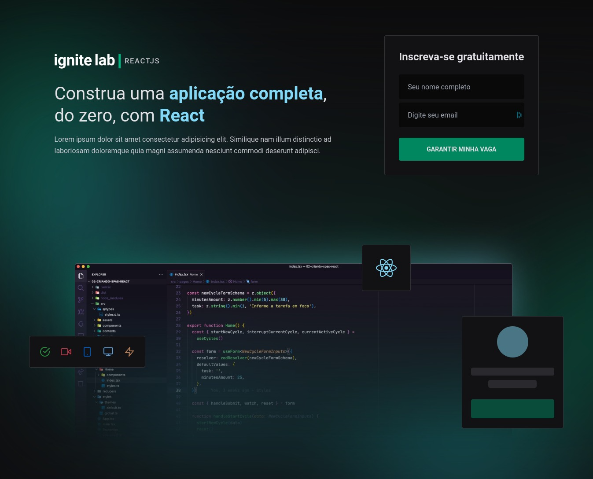

# Ignite Lab

> This is a little project made along [Rocketseat](https://rocketseat.com.br/) that makes a one page website meant to subscribe a person to an event.

- It utilizes [GraphQl](https://graphql.org/) as a database;
- [Tailwind](https://tailwindcss.com/) to style the webpages;
- [Vite](https://vitejs.dev/) to run and build the project super fast;
- The [React](https://reactjs.org/) library for building user interfaces;
- The [Typescript](https://www.typescriptlang.org/) language.

<br>
<br>



<br>

## To Run

To run this project, just do:

```sh
yarn # Install modules.
yarn dev # and then open the url.
```

## To Develop

In order to develop further this project, you must generate the graphql typescript code by typing on your console:

```sh
yarn graphql:generate-code
```
